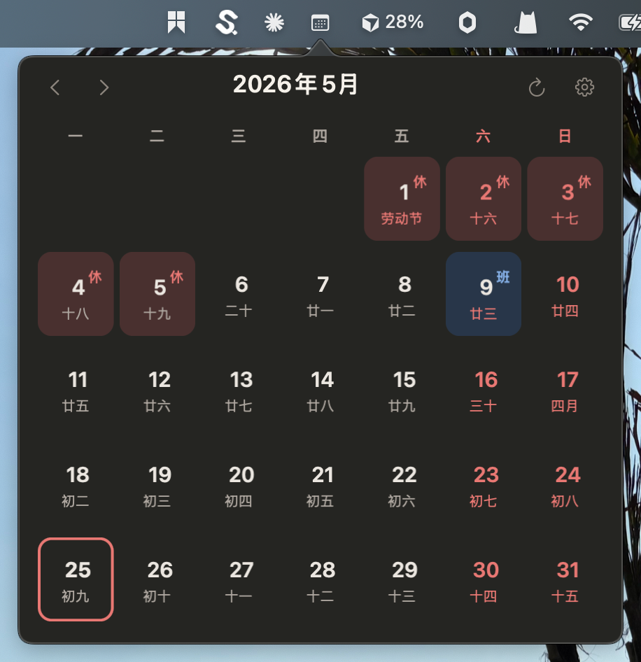
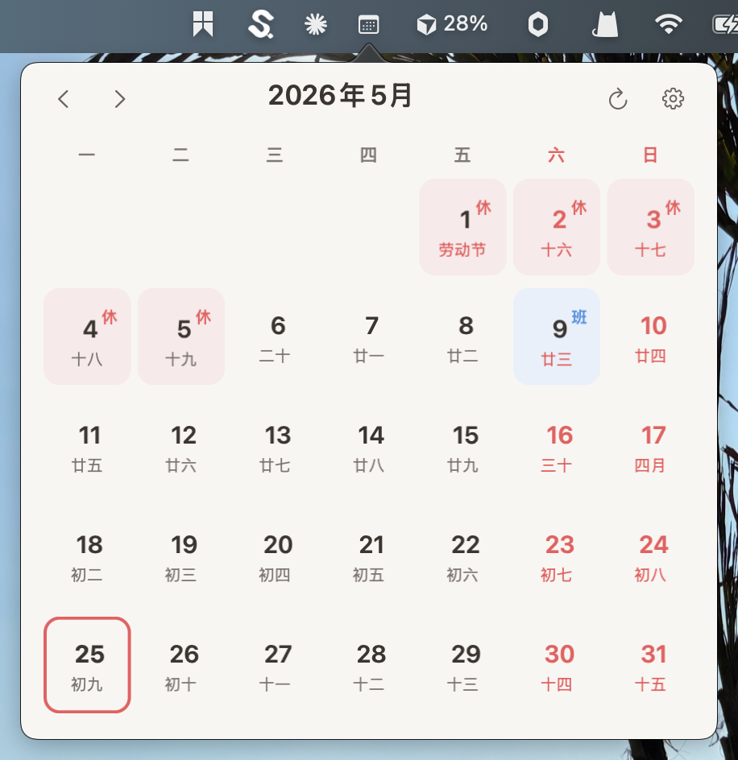
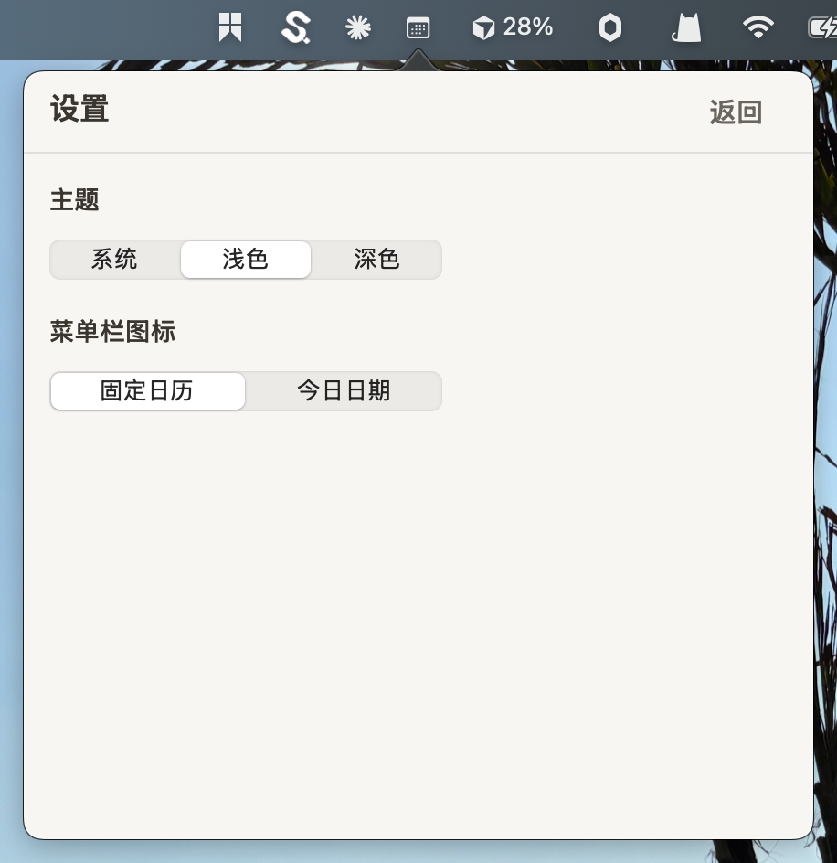

# CalendarPlus

**官网：** https://calendar.caiden.asia

一个基于 AppKit 的 macOS 菜单栏日历应用，支持：

- 月历弹窗（节假日 / 补班角标）
- 农历与中外节日显示
- 设置页主题切换（系统 / 浅色 / 深色）

## 效果预览




## 本地运行

```bash
./start.sh
```

## 测试

```bash
swift test --filter SettingsFlowTests
swift test --filter MonthGridViewRenderTests
```

## 自动构建 DMG

- GitHub Actions: `.github/workflows/build-dmg.yml`
- 触发条件：
  - 推送到 `main`
  - 推送 `v*` 标签
  - 手动触发 `workflow_dispatch`
- 产物：
  - `CalendarPlus-<version>.dmg`
  - 内含 `arm64 + x86_64` 通用二进制

## 手工验收

- `/Users/powercheng/code/projects/calendar-plus/.worktrees/codex-mac-menubar-calendar/docs/testing/manual-qa-menubar-calendar.md`
